# Lede Program 2022 Personal Projects Page

Along with quick checks to make sure your pages are looking their best!

* [erichbuergler.github.io](#erichbuerglergithubio)
* [awidodo.github.io](#awidodogithubio)
* [danihisp.github.io](#danihispgithubio)
* [ramanshreya.github.io](#ramanshreyagithubio)
* [gabrielacarrasquillo.github.io](#gabrielacarrasquillogithubio)
* [sharmaraghavi.github.io](#sharmaraghavigithubio)
* [smeana5.github.io](#smeana5githubio)
* [miotomita.github.io](#miotomitagithubio)
* [luyi-eve.github.io](#luyi-evegithubio)
* [yikchun-l.github.io](#yikchun-lgithubio)
* [github.com](#githubcom)
* [aishichandra.github.io](#aishichandragithubio)
* [carolinaszv.github.io](#carolinaszvgithubio)
* [amanda-chn.github.io](#amanda-chngithubio)
* [atd124.github.io](#atd124githubio)
* [obverter.github.io](#obvertergithubio)
* [ayukaak.github.io](#ayukaakgithubio)
* [bryanbaker-11.github.io](#bryanbaker-11githubio)
* [mcoloncruz.github.io](#mcoloncruzgithubio)
* [tengj98.github.io](#tengj98githubio)
* [vlsachdev.github.io](#vlsachdevgithubio)
* [onlyandrewn.github.io](#onlyandrewngithubio)
* [terril68.github.io](#terril68githubio)
* [stanleydai.github.io](#stanleydaigithubio)
* [dabravs.github.io](#dabravsgithubio)
* [petebrown.github.io](#petebrowngithubio)
* [elizabethkli.github.io](#elizabethkligithubio)
* [rlwin.github.io](#rlwingithubio)
* [cpohkwan.github.io](#cpohkwangithubio)
* [mvol4ok.github.io](#mvol4okgithubio)
* [danielle-li.github.io](#danielle-ligithubio)

## erichbuergler.github.io

|url|mobile|medium|wide|
|---|---|---|---|
|[Even if recycled: Disposable bottles are a big environmental burden](https://erichbuergler.github.io/Website/Beerpackaging.html) :x: og:title :x: og:description :x: og:image [how to fix](tips/SOCIAL.md)||||

### Automatic Checks

**https://erichbuergler.github.io/Website/Beerpackaging.html**

* Move `Website/Beerpackaging.html` into a folder called `Beerpackaging`, then rename the file `index.html`. That way the project can be found at **/Beerpackaging** instead of **/Beerpackaging.html**. [Read more about index.html here](https://www.thoughtco.com/index-html-page-3466505)
* Change URL to be all in lowercase
* Add a link to the repository with your source code/data/analysis: [tutorial](https://jonathansoma.com/fancy-github/), [example](https://github.com/ilenapeng/stevens-creek) from [a story](https://ilenapeng.github.io/data-studio/stevens-creek/)

## awidodo.github.io

|url|mobile|medium|wide|
|---|---|---|---|
|[inclass-graphics](https://awidodo.github.io/columbia_lede2022/project_1.html) :x: og:title :x: og:description :x: og:image [how to fix](tips/SOCIAL.md)||||

### Automatic Checks

**https://awidodo.github.io/columbia_lede2022/project_1.html**

* Move `columbia_lede2022/project_1.html` into a folder called `project_1`, then rename the file `index.html`. That way the project can be found at **/project_1** instead of **/project_1.html**. [Read more about index.html here](https://www.thoughtco.com/index-html-page-3466505)
* Simplify URL by removing `project`. For example, `dog-names` instead of `dog-names-project`.
* Change URL to use `-` instead of spaces or underscores
* Add a link to the repository with your source code/data/analysis: [tutorial](https://jonathansoma.com/fancy-github/), [example](https://github.com/ilenapeng/stevens-creek) from [a story](https://ilenapeng.github.io/data-studio/stevens-creek/)

## danihisp.github.io

|url|mobile|medium|wide|
|---|---|---|---|
|[Webpage project](https://danihisp.github.io/olympics/) :x: og:title :x: og:description :x: og:image [how to fix](tips/SOCIAL.md)||||

### Automatic Checks

**https://danihisp.github.io/olympics/**

* Add a link to the repository with your source code/data/analysis: [tutorial](https://jonathansoma.com/fancy-github/), [example](https://github.com/ilenapeng/stevens-creek) from [a story](https://ilenapeng.github.io/data-studio/stevens-creek/)

## ramanshreya.github.io

|url|mobile|medium|wide|
|---|---|---|---|
|[Site not found · GitHub Pages](https://ramanshreya.github.io/Female-Chess-Players/) :x: og:title :x: og:description :x: og:image [how to fix](tips/SOCIAL.md)|request failed|request failed|request failed|

### Automatic Checks

**https://ramanshreya.github.io/Female-Chess-Players/**

* Could not access the page - if you moved it, let me know
* Change URL to be all in lowercase
* Missing viewport meta tag in `<head>`, needed to tell browser it's responsive. Add `<meta name="viewport" content="width=device-width, initial-scale=1, shrink-to-fit=no">`
* Has sideways scrollbars in mobile version – check padding, margins, image widths. Also make sure any embeds are the responsive version. [How to view the mobile version](https://www.howtogeek.com/739812/how-to-view-mobile-websites-on-your-computer-in-chrome/)

## gabrielacarrasquillo.github.io

|url|mobile|medium|wide|
|---|---|---|---|
|[2022 is on track to break sargassum production records in the Atlantic Ocean](https://gabrielacarrasquillo.github.io/sargassum-story/) :x: og:title :x: og:description :x: og:image [how to fix](tips/SOCIAL.md)||||

### Automatic Checks

**https://gabrielacarrasquillo.github.io/sargassum-story/**

* Add a link to the repository with your source code/data/analysis: [tutorial](https://jonathansoma.com/fancy-github/), [example](https://github.com/ilenapeng/stevens-creek) from [a story](https://ilenapeng.github.io/data-studio/stevens-creek/)

## sharmaraghavi.github.io

|url|mobile|medium|wide|
|---|---|---|---|
|[Income of Indian National Political Parties](https://sharmaraghavi.github.io/income/) :x: og:title :x: og:description :x: og:image [how to fix](tips/SOCIAL.md)||||

### Automatic Checks

**https://sharmaraghavi.github.io/income/**

* Has sideways scrollbars in mobile version – check padding, margins, image widths. Also make sure any embeds are the responsive version. [How to view the mobile version](https://www.howtogeek.com/739812/how-to-view-mobile-websites-on-your-computer-in-chrome/)
* Add a link to the repository with your source code/data/analysis: [tutorial](https://jonathansoma.com/fancy-github/), [example](https://github.com/ilenapeng/stevens-creek) from [a story](https://ilenapeng.github.io/data-studio/stevens-creek/)

## smeana5.github.io

|url|mobile|medium|wide|
|---|---|---|---|
|[fifa-selection-2022/index.html](https://smeana5.github.io/fifa-selection-2022/) :x: og:title :x: og:description :x: og:image [how to fix](tips/SOCIAL.md)||||

### Automatic Checks

**https://smeana5.github.io/fifa-selection-2022/**

* Needs a title, add a `<title>` tag to the `<head>`
* Add a link to the repository with your source code/data/analysis: [tutorial](https://jonathansoma.com/fancy-github/), [example](https://github.com/ilenapeng/stevens-creek) from [a story](https://ilenapeng.github.io/data-studio/stevens-creek/)

## miotomita.github.io

|url|mobile|medium|wide|
|---|---|---|---|
|[Risk of Bird Extinction Remains High](https://miotomita.github.io/Lede_project1/) :x: og:title :x: og:description :x: og:image [how to fix](tips/SOCIAL.md)||||

### Automatic Checks

**https://miotomita.github.io/Lede_project1/**

* Simplify URL by removing `project`. For example, `dog-names` instead of `dog-names-project`.
* Change URL to use `-` instead of spaces or underscores
* Change URL to be all in lowercase
* Add a link to the repository with your source code/data/analysis: [tutorial](https://jonathansoma.com/fancy-github/), [example](https://github.com/ilenapeng/stevens-creek) from [a story](https://ilenapeng.github.io/data-studio/stevens-creek/)

## luyi-eve.github.io

|url|mobile|medium|wide|
|---|---|---|---|
|[Project One](https://luyi-eve.github.io/project-one/) :x: og:title :x: og:description :x: og:image [how to fix](tips/SOCIAL.md)||||

### Automatic Checks

**https://luyi-eve.github.io/project-one/**

* Image(s) need `alt` tags, [info here](https://abilitynet.org.uk/news-blogs/five-golden-rules-compliant-alt-text) and [tips here](https://twitter.com/FrankElavsky/status/1469023374529765385)
    * Image `Word cloud.svg` missing `alt` tag
    * Image `gender.svg` missing `alt` tag
    * Image `age.svg` missing `alt` tag
    * Image `mapping.svg` missing `alt` tag
    * Image `locations.svg` missing `alt` tag
    * Image `types.svg` missing `alt` tag
    * Image `reasons.svg` missing `alt` tag
* Simplify URL by removing `project`. For example, `dog-names` instead of `dog-names-project`.
* Add a link to the repository with your source code/data/analysis: [tutorial](https://jonathansoma.com/fancy-github/), [example](https://github.com/ilenapeng/stevens-creek) from [a story](https://ilenapeng.github.io/data-studio/stevens-creek/)

## yikchun-l.github.io

|url|mobile|medium|wide|
|---|---|---|---|
|[Will Adopting Apps Reverse Singapore's Taxi Shortage?](https://yikchun-l.github.io/project-01/) :x: og:title :x: og:description :x: og:image [how to fix](tips/SOCIAL.md)||||

### Automatic Checks

**https://yikchun-l.github.io/project-01/**

* Simplify URL by removing `project`. For example, `dog-names` instead of `dog-names-project`.
* Add a link to the repository with your source code/data/analysis: [tutorial](https://jonathansoma.com/fancy-github/), [example](https://github.com/ilenapeng/stevens-creek) from [a story](https://ilenapeng.github.io/data-studio/stevens-creek/)

## github.com

|url|mobile|medium|wide|
|---|---|---|---|
|[GitHub - torythetortle/4clmba1: here ya go!](https://github.com/torythetortle/project4clmba1.git)|[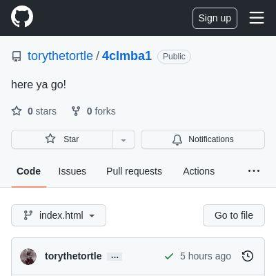](screenshots/github.com/torythetortle_project4clmba1.git_index.html-mobile-full.jpg)|[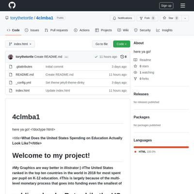](screenshots/github.com/torythetortle_project4clmba1.git_index.html-medium-full.jpg)|[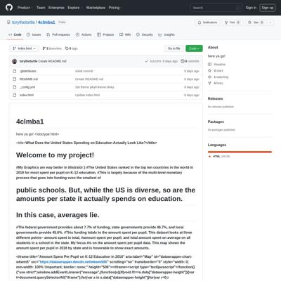](screenshots/github.com/torythetortle_project4clmba1.git_index.html-wide-full.jpg)|

### Automatic Checks

**https://github.com/torythetortle/project4clmba1.git**

* Simplify URL by removing `project`. For example, `dog-names` instead of `dog-names-project`.

## aishichandra.github.io

|url|mobile|medium|wide|
|---|---|---|---|
|[The Rise of Joni Mitchell in Popular Culture](https://aishichandra.github.io/Joni-Mitchell/) :x: og:title :x: og:description :x: og:image [how to fix](tips/SOCIAL.md)||||

### Automatic Checks

**https://aishichandra.github.io/Joni-Mitchell/**

* Image(s) need `alt` tags, [info here](https://abilitynet.org.uk/news-blogs/five-golden-rules-compliant-alt-text) and [tips here](https://twitter.com/FrankElavsky/status/1469023374529765385)
    * Image `Asset 2.svg` missing `alt` tag
    * Image `Asset 50.svg` missing `alt` tag
    * Image `Asset 52.svg` missing `alt` tag
* Change URL to be all in lowercase
* Add a link to the repository with your source code/data/analysis: [tutorial](https://jonathansoma.com/fancy-github/), [example](https://github.com/ilenapeng/stevens-creek) from [a story](https://ilenapeng.github.io/data-studio/stevens-creek/)

## carolinaszv.github.io

|url|mobile|medium|wide|
|---|---|---|---|
|[USA holds World Cup attendance record](https://carolinaszv.github.io/1994-US-World-Cup-attendance-record/) :x: og:title :x: og:description :x: og:image [how to fix](tips/SOCIAL.md)||||

### Automatic Checks

**https://carolinaszv.github.io/1994-US-World-Cup-attendance-record/**

* Image(s) need `alt` tags, [info here](https://abilitynet.org.uk/news-blogs/five-golden-rules-compliant-alt-text) and [tips here](https://twitter.com/FrankElavsky/status/1469023374529765385)
    * Image `https://upload.wikimedia.org/wikipedia/commons/3/3c/0094_Sports_-_1994_World_Cup_01_%286956398635%29.jpg` missing `alt` tag
* Change URL to be all in lowercase
* Missing viewport meta tag in `<head>`, needed to tell browser it's responsive. Add `<meta name="viewport" content="width=device-width, initial-scale=1, shrink-to-fit=no">`
* Add a link to the repository with your source code/data/analysis: [tutorial](https://jonathansoma.com/fancy-github/), [example](https://github.com/ilenapeng/stevens-creek) from [a story](https://ilenapeng.github.io/data-studio/stevens-creek/)

## amanda-chn.github.io

|url|mobile|medium|wide|
|---|---|---|---|
|[Understanding NYC Parks, and misleading numbers.](https://amanda-chn.github.io/NYC-Parks/) :x: og:title :x: og:description :x: og:image [how to fix](tips/SOCIAL.md)||||

### Automatic Checks

**https://amanda-chn.github.io/NYC-Parks/**

* Change URL to be all in lowercase
* Has sideways scrollbars in mobile version – check padding, margins, image widths. Also make sure any embeds are the responsive version. [How to view the mobile version](https://www.howtogeek.com/739812/how-to-view-mobile-websites-on-your-computer-in-chrome/)
* Minimum font size should be 12px, enlarge text in Illustrator
    * Text `8,229 acres of green space` is too small at 10px
    * Text `7,664 acres of green space` is too small at 9px
    * Text `4,857 acres of green space` is too small at 8px
    * Text `2,872 acres of green space` is too small at 8px
    * Text `7,225 acres of green space` is too small at 9px
    * Text `8,229 acres of green space` is too small at 10px
    * Text `7,664 acres of green space` is too small at 9px
    * *and 254 more*
* Overlapping elements in ai2html, check [the overflow video](https://www.youtube.com/watch?v=6vHsnjTp3_w) or make a smaller size
   * Text `Community Park` overlaps with `Jointly` at screen width 400
   * Text `Community Park` overlaps with `Operated` at screen width 400
   * Text `Community Park` overlaps with `Playground` at screen width 400
   * Text `Waterfront Facility` overlaps with `Neighborhood` at screen width 400
   * Text `Playground` overlaps with `Undeveloped` at screen width 400
   * Text `Waterfront Facility` overlaps with `Neighborhood` at screen width 400
   * Text `Neighborhood` overlaps with `Managed Sites` at screen width 400
   * *and 19 more*
* Add a link to the repository with your source code/data/analysis: [tutorial](https://jonathansoma.com/fancy-github/), [example](https://github.com/ilenapeng/stevens-creek) from [a story](https://ilenapeng.github.io/data-studio/stevens-creek/)

## atd124.github.io

|url|mobile|medium|wide|
|---|---|---|---|
|[Site not found · GitHub Pages](https://atd124.github.io/Columbia-Lede-Project/) :x: og:title :x: og:description :x: og:image [how to fix](tips/SOCIAL.md)|request failed|request failed|request failed|

### Automatic Checks

**https://atd124.github.io/Columbia-Lede-Project/**

* Could not access the page - if you moved it, let me know
* Change URL to be all in lowercase
* Missing viewport meta tag in `<head>`, needed to tell browser it's responsive. Add `<meta name="viewport" content="width=device-width, initial-scale=1, shrink-to-fit=no">`
* Has sideways scrollbars in mobile version – check padding, margins, image widths. Also make sure any embeds are the responsive version. [How to view the mobile version](https://www.howtogeek.com/739812/how-to-view-mobile-websites-on-your-computer-in-chrome/)

## obverter.github.io

|url|mobile|medium|wide|
|---|---|---|---|
|[Complete Games Are Done  obvertɘr is Ben Elliott](https://obverter.github.io/complete-games) :x: og:image [how to fix](tips/SOCIAL.md)|[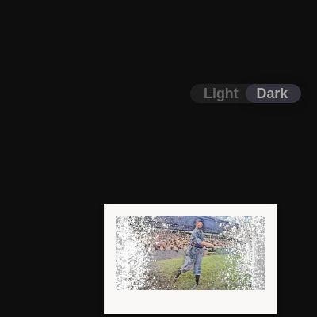](screenshots/obverter.github.io/complete-games_index.html-mobile-full.jpg)|[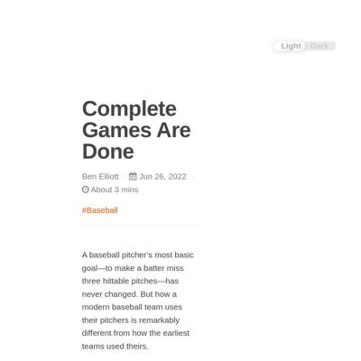](screenshots/obverter.github.io/complete-games_index.html-medium-full.jpg)|[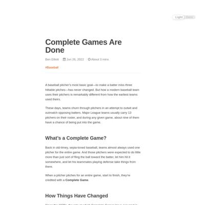](screenshots/obverter.github.io/complete-games_index.html-wide-full.jpg)|

### Automatic Checks

**https://obverter.github.io/complete-games**

* Image(s) need `alt` tags, [info here](https://abilitynet.org.uk/news-blogs/five-golden-rules-compliant-alt-text) and [tips here](https://twitter.com/FrankElavsky/status/1469023374529765385)
    * Image `` missing `alt` tag

## ayukaak.github.io

|url|mobile|medium|wide|
|---|---|---|---|
|[Is climate change threatening food security in Tanzania?](https://ayukaak.github.io/ClimateChangeInTanzania/) :x: og:title :x: og:description :x: og:image [how to fix](tips/SOCIAL.md)||||

### Automatic Checks

**https://ayukaak.github.io/ClimateChangeInTanzania/**

* Change URL to be all in lowercase
* Add a link to the repository with your source code/data/analysis: [tutorial](https://jonathansoma.com/fancy-github/), [example](https://github.com/ilenapeng/stevens-creek) from [a story](https://ilenapeng.github.io/data-studio/stevens-creek/)

## bryanbaker-11.github.io

|url|mobile|medium|wide|
|---|---|---|---|
|[MLB Shift Story](https://bryanbaker-11.github.io/lhh-shift/) :x: og:title :x: og:description :x: og:image [how to fix](tips/SOCIAL.md)||||

### Automatic Checks

**https://bryanbaker-11.github.io/lhh-shift/**

* Has sideways scrollbars in mobile version – check padding, margins, image widths. Also make sure any embeds are the responsive version. [How to view the mobile version](https://www.howtogeek.com/739812/how-to-view-mobile-websites-on-your-computer-in-chrome/)
* Add a link to the repository with your source code/data/analysis: [tutorial](https://jonathansoma.com/fancy-github/), [example](https://github.com/ilenapeng/stevens-creek) from [a story](https://ilenapeng.github.io/data-studio/stevens-creek/)

## mcoloncruz.github.io

|url|mobile|medium|wide|
|---|---|---|---|
|[Guns and femicides](https://mcoloncruz.github.io/project-femicides/) :x: og:title :x: og:description :x: og:image [how to fix](tips/SOCIAL.md)||||

### Automatic Checks

**https://mcoloncruz.github.io/project-femicides/**

* Image(s) need `alt` tags, [info here](https://abilitynet.org.uk/news-blogs/five-golden-rules-compliant-alt-text) and [tips here](https://twitter.com/FrankElavsky/status/1469023374529765385)
    * Image `62219986_356090471706116_7564854086038716416_n.jpg` missing `alt` tag
* Simplify URL by removing `project`. For example, `dog-names` instead of `dog-names-project`.
* Add a link to the repository with your source code/data/analysis: [tutorial](https://jonathansoma.com/fancy-github/), [example](https://github.com/ilenapeng/stevens-creek) from [a story](https://ilenapeng.github.io/data-studio/stevens-creek/)

## tengj98.github.io

|url|mobile|medium|wide|
|---|---|---|---|
|[How COVID-19 upended bankruptcy trends](https://tengj98.github.io/covidbankruptcy/)||||

### Automatic Checks

**https://tengj98.github.io/covidbankruptcy/**

* Add a link to the repository with your source code/data/analysis: [tutorial](https://jonathansoma.com/fancy-github/), [example](https://github.com/ilenapeng/stevens-creek) from [a story](https://ilenapeng.github.io/data-studio/stevens-creek/)

## vlsachdev.github.io

|url|mobile|medium|wide|
|---|---|---|---|
|[Cryptocuurency_Gold](https://vlsachdev.github.io/cryptocurreny_gold/) :x: og:title :x: og:description :x: og:image [how to fix](tips/SOCIAL.md)||||

### Automatic Checks

**https://vlsachdev.github.io/cryptocurreny_gold/**

* Change URL to use `-` instead of spaces or underscores
* Add a link to the repository with your source code/data/analysis: [tutorial](https://jonathansoma.com/fancy-github/), [example](https://github.com/ilenapeng/stevens-creek) from [a story](https://ilenapeng.github.io/data-studio/stevens-creek/)

## onlyandrewn.github.io

|url|mobile|medium|wide|
|---|---|---|---|
|[Are tornadoes in the U.S. becoming more frequent and more intense?](https://onlyandrewn.github.io/project-01/) :x: og:title :x: og:description :x: og:image [how to fix](tips/SOCIAL.md)||||

### Automatic Checks

**https://onlyandrewn.github.io/project-01/**

* Simplify URL by removing `project`. For example, `dog-names` instead of `dog-names-project`.
* Add a link to the repository with your source code/data/analysis: [tutorial](https://jonathansoma.com/fancy-github/), [example](https://github.com/ilenapeng/stevens-creek) from [a story](https://ilenapeng.github.io/data-studio/stevens-creek/)

## terril68.github.io

|url|mobile|medium|wide|
|---|---|---|---|
|[Teresa Liu's first LEDE project](https://terril68.github.io/animals-adoptions-during-the-pandemic/) :x: og:title :x: og:description :x: og:image [how to fix](tips/SOCIAL.md)||||

### Automatic Checks

**https://terril68.github.io/animals-adoptions-during-the-pandemic/**

* Add a link to the repository with your source code/data/analysis: [tutorial](https://jonathansoma.com/fancy-github/), [example](https://github.com/ilenapeng/stevens-creek) from [a story](https://ilenapeng.github.io/data-studio/stevens-creek/)

## stanleydai.github.io

|url|mobile|medium|wide|
|---|---|---|---|
|[NBA rookies and their winning contributions](https://stanleydai.github.io/nba_rookies_age/) :x: og:title :x: og:description :x: og:image [how to fix](tips/SOCIAL.md)||||

### Automatic Checks

**https://stanleydai.github.io/nba_rookies_age/**

* Change URL to use `-` instead of spaces or underscores
* Add a link to the repository with your source code/data/analysis: [tutorial](https://jonathansoma.com/fancy-github/), [example](https://github.com/ilenapeng/stevens-creek) from [a story](https://ilenapeng.github.io/data-studio/stevens-creek/)

## dabravs.github.io

|url|mobile|medium|wide|
|---|---|---|---|
|[This is how often each Pokémon type shows up in Gen 1](https://dabravs.github.io/pokemon-project/) :x: og:title :x: og:description :x: og:image [how to fix](tips/SOCIAL.md)||||

### Automatic Checks

**https://dabravs.github.io/pokemon-project/**

* Simplify URL by removing `project`. For example, `dog-names` instead of `dog-names-project`.
* Add a link to the repository with your source code/data/analysis: [tutorial](https://jonathansoma.com/fancy-github/), [example](https://github.com/ilenapeng/stevens-creek) from [a story](https://ilenapeng.github.io/data-studio/stevens-creek/)

## petebrown.github.io

|url|mobile|medium|wide|
|---|---|---|---|
|[Project 1: A Couple of Charts](https://petebrown.github.io/project-01/) :x: og:title :x: og:description :x: og:image [how to fix](tips/SOCIAL.md)||||

### Automatic Checks

**https://petebrown.github.io/project-01/**

* Simplify URL by removing `project`. For example, `dog-names` instead of `dog-names-project`.
* Add a link to the repository with your source code/data/analysis: [tutorial](https://jonathansoma.com/fancy-github/), [example](https://github.com/ilenapeng/stevens-creek) from [a story](https://ilenapeng.github.io/data-studio/stevens-creek/)

## elizabethkli.github.io

|url|mobile|medium|wide|
|---|---|---|---|
|[Lizzie Li Project Website](https://elizabethkli.github.io/family-group-chat/) :x: og:title :x: og:description :x: og:image [how to fix](tips/SOCIAL.md)||||

### Automatic Checks

**https://elizabethkli.github.io/family-group-chat/**

* Image(s) need `alt` tags, [info here](https://abilitynet.org.uk/news-blogs/five-golden-rules-compliant-alt-text) and [tips here](https://twitter.com/FrankElavsky/status/1469023374529765385)
    * Image `../logo.png` missing `alt` tag
    * Image `../famphoto.png` missing `alt` tag
* Add a link to the repository with your source code/data/analysis: [tutorial](https://jonathansoma.com/fancy-github/), [example](https://github.com/ilenapeng/stevens-creek) from [a story](https://ilenapeng.github.io/data-studio/stevens-creek/)

## rlwin.github.io

|url|mobile|medium|wide|
|---|---|---|---|
|[Rachel Win](https://rlwin.github.io/index.html) :x: og:title :x: og:description :x: og:image [how to fix](tips/SOCIAL.md)|[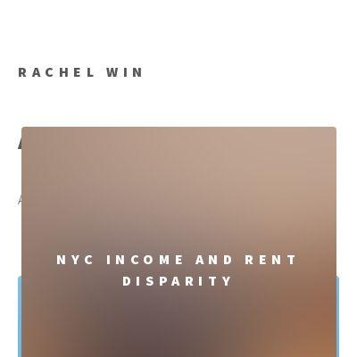](screenshots/rlwin.github.io/index.html-mobile-full.jpg)|[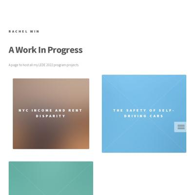](screenshots/rlwin.github.io/index.html-medium-full.jpg)|[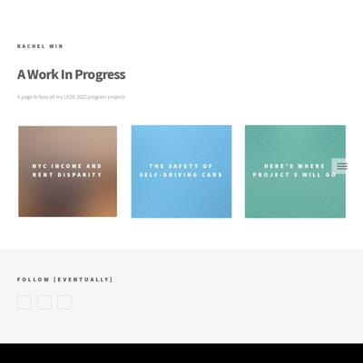](screenshots/rlwin.github.io/index.html-wide-full.jpg)|

### Automatic Checks

**https://rlwin.github.io/index.html**

* Add a link to the repository with your source code/data/analysis: [tutorial](https://jonathansoma.com/fancy-github/), [example](https://github.com/ilenapeng/stevens-creek) from [a story](https://ilenapeng.github.io/data-studio/stevens-creek/)

## cpohkwan.github.io

|url|mobile|medium|wide|
|---|---|---|---|
|[My Project](https://cpohkwan.github.io/project-website/) :x: og:title :x: og:description :x: og:image [how to fix](tips/SOCIAL.md)|[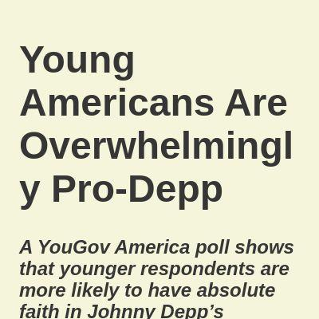](screenshots/cpohkwan.github.io/project-website_index.html-mobile-full.jpg)|[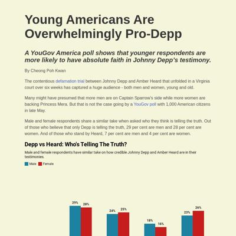](screenshots/cpohkwan.github.io/project-website_index.html-medium-full.jpg)|[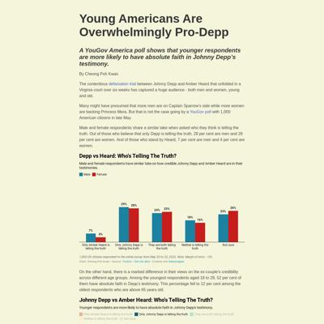](screenshots/cpohkwan.github.io/project-website_index.html-wide-full.jpg)|

### Automatic Checks

**https://cpohkwan.github.io/project-website/**

* Simplify URL by removing `project`. For example, `dog-names` instead of `dog-names-project`.
* Add a link to the repository with your source code/data/analysis: [tutorial](https://jonathansoma.com/fancy-github/), [example](https://github.com/ilenapeng/stevens-creek) from [a story](https://ilenapeng.github.io/data-studio/stevens-creek/)

## mvol4ok.github.io

|url|mobile|medium|wide|
|---|---|---|---|
|[Goes up top!!!!](https://mvol4ok.github.io/) :x: og:title :x: og:description :x: og:image [how to fix](tips/SOCIAL.md)||||

### Automatic Checks

**https://mvol4ok.github.io/**

* Add a link to the repository with your source code/data/analysis: [tutorial](https://jonathansoma.com/fancy-github/), [example](https://github.com/ilenapeng/stevens-creek) from [a story](https://ilenapeng.github.io/data-studio/stevens-creek/)

## danielle-li.github.io

|url|mobile|medium|wide|
|---|---|---|---|
|[Climbing's Sexist Route Names](https://danielle-li.github.io/climbing-routes/) :x: og:title :x: og:description :x: og:image [how to fix](tips/SOCIAL.md)||||

### Automatic Checks

**https://danielle-li.github.io/climbing-routes/**

No issues found! 🎉

