# Lede Program 2022 Personal Projects Page

Along with quick checks to make sure your pages are looking their best!

* [aishichandra.github.io](#aishichandragithubio)
* [amanda-chn.github.io](#amanda-chngithubio)
* [atd124.github.io](#atd124githubio)
* [awidodo.github.io](#awidodogithubio)
* [ayukaak.github.io](#ayukaakgithubio)
* [bryanbaker-11.github.io](#bryanbaker-11githubio)
* [carolinaszv.github.io](#carolinaszvgithubio)
* [cpohkwan.github.io](#cpohkwangithubio)
* [dabravs.github.io](#dabravsgithubio)
* [danielle-li.github.io](#danielle-ligithubio)
* [danihisp.github.io](#danihispgithubio)
* [elizabethkli.github.io](#elizabethkligithubio)
* [erichbuergler.github.io](#erichbuerglergithubio)
* [gabrielacarrasquillo.github.io](#gabrielacarrasquillogithubio)
* [luyi-eve.github.io](#luyi-evegithubio)
* [mcoloncruz.github.io](#mcoloncruzgithubio)
* [miotomita.github.io](#miotomitagithubio)
* [mvol4ok.github.io](#mvol4okgithubio)
* [nkalanga.github.io](#nkalangagithubio)
* [obverter.github.io](#obvertergithubio)
* [onlyandrewn.github.io](#onlyandrewngithubio)
* [oparra06.github.io](#oparra06githubio)
* [petebrown.github.io](#petebrowngithubio)
* [ramanshreya.github.io](#ramanshreyagithubio)
* [rlwin.github.io](#rlwingithubio)
* [sharmaraghavi.github.io](#sharmaraghavigithubio)
* [smeana5.github.io](#smeana5githubio)
* [stanleydai.github.io](#stanleydaigithubio)
* [tengj98.github.io](#tengj98githubio)
* [terril68.github.io](#terril68githubio)
* [torythetortle.github.io](#torythetortlegithubio)
* [vlsachdev.github.io](#vlsachdevgithubio)
* [yikchun-l.github.io](#yikchun-lgithubio)

## aishichandra.github.io

|url|mobile|medium|wide|
|---|---|---|---|
|[The Rise of Joni Mitchell in Popular Culture](https://aishichandra.github.io/Joni-Mitchell/) :x: og:title :x: og:description :x: og:image [how to fix](tips/SOCIAL.md)||[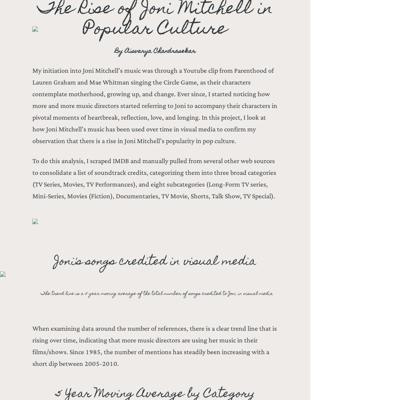](screenshots/aishichandra.github.io/Joni-Mitchell_index.html-medium-full.jpg)|[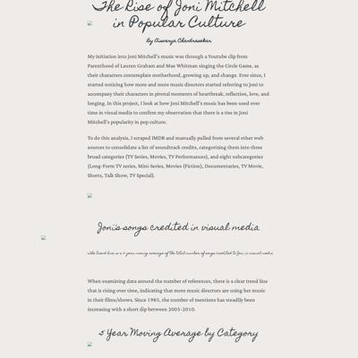](screenshots/aishichandra.github.io/Joni-Mitchell_index.html-wide-full.jpg)|
|[American Slang in the NYT Crossword](https://aishichandra.github.io/Slang_NYT_XWord/) :x: og:title :x: og:description :x: og:image [how to fix](tips/SOCIAL.md)|[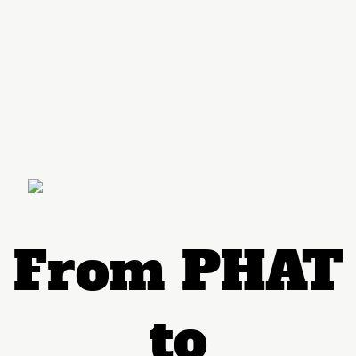](screenshots/aishichandra.github.io/Slang_NYT_XWord_index.html-mobile-full.jpg)|[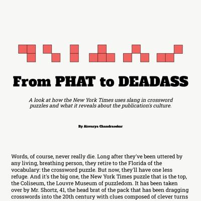](screenshots/aishichandra.github.io/Slang_NYT_XWord_index.html-medium-full.jpg)|[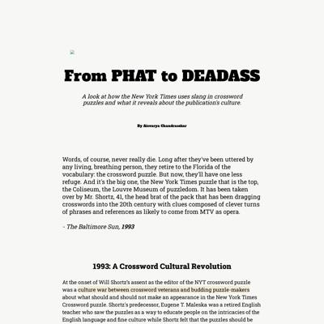](screenshots/aishichandra.github.io/Slang_NYT_XWord_index.html-wide-full.jpg)|

### Automatic Checks

**https://aishichandra.github.io/Joni-Mitchell/**

* Image(s) need `alt` tags, [info here](https://abilitynet.org.uk/news-blogs/five-golden-rules-compliant-alt-text) and [tips here](https://twitter.com/FrankElavsky/status/1469023374529765385)
    * Image `Asset 2.svg` missing `alt` tag
    * Image `Asset 50.svg` missing `alt` tag
    * Image `Asset 52.svg` missing `alt` tag
* Change URL to be all in lowercase
* Add a link to the repository with your source code/data/analysis: [tutorial](https://jonathansoma.com/fancy-github/), [example](https://github.com/ilenapeng/stevens-creek) from [a story](https://ilenapeng.github.io/data-studio/stevens-creek/)

**https://aishichandra.github.io/Slang_NYT_XWord/**

* Image(s) need `alt` tags, [info here](https://abilitynet.org.uk/news-blogs/five-golden-rules-compliant-alt-text) and [tips here](https://twitter.com/FrankElavsky/status/1469023374529765385)
    * Image `1x\Asset 4.png` missing `alt` tag
* Change URL to use `-` instead of spaces or underscores
* Change URL to be all in lowercase
* Minimum font size should be 12px, enlarge text in Illustrator
    * Text `400` is too small at 7px
    * Text `300` is too small at 7px
    * Text `200` is too small at 7px
    * Text `100` is too small at 7px
    * Text `100` is too small at 5px
    * Text `200` is too small at 5px
    * Text `300` is too small at 5px
    * *and 116 more*

## amanda-chn.github.io

|url|mobile|medium|wide|
|---|---|---|---|
|[Understanding NYC Parks, and misleading numbers.](https://amanda-chn.github.io/NYC-Parks/) :x: og:title :x: og:description :x: og:image [how to fix](tips/SOCIAL.md)|[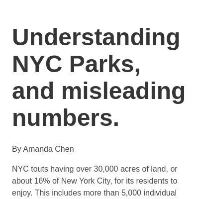](screenshots/amanda-chn.github.io/NYC-Parks_index.html-mobile-full.jpg)|[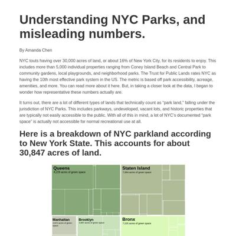](screenshots/amanda-chn.github.io/NYC-Parks_index.html-medium-full.jpg)|[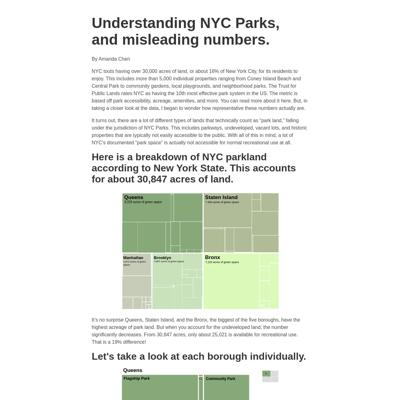](screenshots/amanda-chn.github.io/NYC-Parks_index.html-wide-full.jpg)|
|[Why does this Caribbean takeout taste so… Indian?](https://amanda-chn.github.io/spices/) :x: og:title :x: og:description :x: og:image [how to fix](tips/SOCIAL.md)||[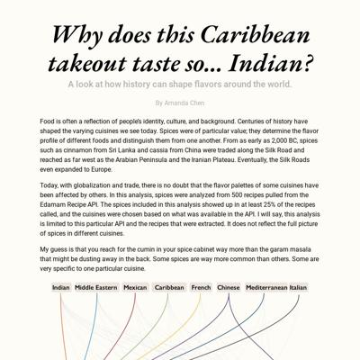](screenshots/amanda-chn.github.io/spices_index.html-medium-full.jpg)|[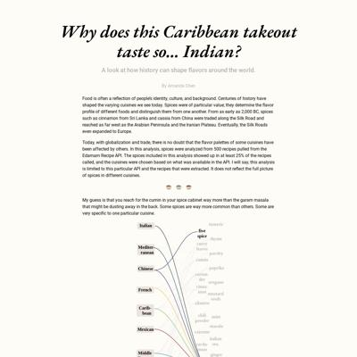](screenshots/amanda-chn.github.io/spices_index.html-wide-full.jpg)|

### Automatic Checks

**https://amanda-chn.github.io/NYC-Parks/**

* Change URL to be all in lowercase
* Minimum font size should be 12px, enlarge text in Illustrator
    * Text `8,229 acres of green space` is too small at 10px
    * Text `7,664 acres of green space` is too small at 9px
    * Text `4,857 acres of green space` is too small at 8px
    * Text `2,872 acres of green space` is too small at 8px
    * Text `7,225 acres of green space` is too small at 9px
    * Text `8,229 acres of green space` is too small at 10px
    * Text `7,664 acres of green space` is too small at 9px
    * *and 254 more*
* Overlapping elements in ai2html, check [the overflow video](https://www.youtube.com/watch?v=6vHsnjTp3_w) or make a smaller size
   * Text `Community Park` overlaps with `Operated` at screen width 400
   * Text `Nature Area` overlaps with `Parkway` at screen width 400
   * Text `Waterfront Facility` overlaps with `Neighborhood` at screen width 400
   * Text `Waterfront Facility` overlaps with `Neighborhood` at screen width 400
   * Text `Neighborhood` overlaps with `Nature` at screen width 400
   * Text `Recreational` overlaps with `Neighborhood` at screen width 400
   * Text `Community Park` overlaps with `Jointly` at screen width 900
   * *and 16 more*
* Add a link to the repository with your source code/data/analysis: [tutorial](https://jonathansoma.com/fancy-github/), [example](https://github.com/ilenapeng/stevens-creek) from [a story](https://ilenapeng.github.io/data-studio/stevens-creek/)

**https://amanda-chn.github.io/spices/**

* Image(s) need `alt` tags, [info here](https://abilitynet.org.uk/news-blogs/five-golden-rules-compliant-alt-text) and [tips here](https://twitter.com/FrankElavsky/status/1469023374529765385)
    * Image `separator.png` missing `alt` tag
    * Image `separator.png` missing `alt` tag
    * Image `separator.png` missing `alt` tag
* Overlapping elements in ai2html, check [the overflow video](https://www.youtube.com/watch?v=6vHsnjTp3_w) or make a smaller size
   * Text `mon` overlaps with `mustard seeds` at screen width 400
   * Text `italian sea.` overlaps with `carda-` at screen width 400
   * Text `mon` overlaps with `mustard seeds` at screen width 900
   * Text `italian sea.` overlaps with `carda-` at screen width 900
   * Text `chili powder` overlaps with `cinna-` at screen width 1300
   * Text `chili powder` overlaps with `mon` at screen width 1300
   * Text `cinna-` overlaps with `coriander` at screen width 1300
   * *and 23 more*
* Missing font(s), you might need web fonts – [text explanation](https://gist.github.com/jsoma/631621e0807b26d49f5aef5260f79162), [video explanation](https://www.youtube.com/watch?v=HNhIeb_jEYM&list=PLewNEVDy7gq3MSrrO3eMEW8PhGMEVh2X2&index=3)
    * `"Gill Sans Nova"` font not found, used in 257 text objects. Example: _Indian, Middle Eastern, Mexican_

## atd124.github.io

|url|mobile|medium|wide|
|---|---|---|---|
|[Site not found · GitHub Pages](https://atd124.github.io/columbia-lede/) :x: og:title :x: og:description :x: og:image [how to fix](tips/SOCIAL.md)|request failed|request failed|request failed|
|[Site not found · GitHub Pages](https://atd124.github.io/Did-you-ever-notice/) :x: og:title :x: og:description :x: og:image [how to fix](tips/SOCIAL.md)|request failed|request failed|request failed|

### Automatic Checks

**https://atd124.github.io/columbia-lede/**

* Could not access the page - if you moved it, let me know
* Missing viewport meta tag in `<head>`, needed to tell browser it's responsive. Add `<meta name="viewport" content="width=device-width, initial-scale=1, shrink-to-fit=no">`
* Has sideways scrollbars in mobile version – check padding, margins, image widths. Also make sure any embeds are the responsive version. [How to view the mobile version](https://www.howtogeek.com/739812/how-to-view-mobile-websites-on-your-computer-in-chrome/)

**https://atd124.github.io/Did-you-ever-notice/**

* Could not access the page - if you moved it, let me know
* Change URL to be all in lowercase
* Missing viewport meta tag in `<head>`, needed to tell browser it's responsive. Add `<meta name="viewport" content="width=device-width, initial-scale=1, shrink-to-fit=no">`
* Has sideways scrollbars in mobile version – check padding, margins, image widths. Also make sure any embeds are the responsive version. [How to view the mobile version](https://www.howtogeek.com/739812/how-to-view-mobile-websites-on-your-computer-in-chrome/)

## awidodo.github.io

|url|mobile|medium|wide|
|---|---|---|---|
|[inclass-graphics](https://awidodo.github.io/columbia_lede2022/project_1.html) :x: og:title :x: og:description :x: og:image [how to fix](tips/SOCIAL.md)|[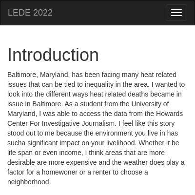](screenshots/awidodo.github.io/columbia_lede2022_project_1.html-mobile-full.jpg)|[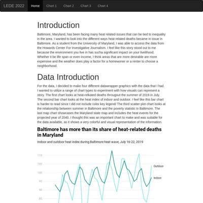](screenshots/awidodo.github.io/columbia_lede2022_project_1.html-medium-full.jpg)|[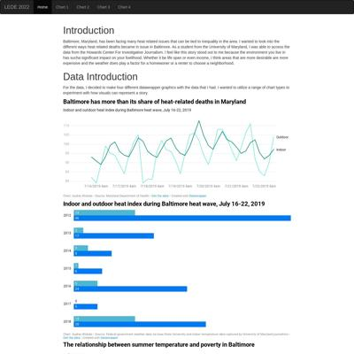](screenshots/awidodo.github.io/columbia_lede2022_project_1.html-wide-full.jpg)|

### Automatic Checks

**https://awidodo.github.io/columbia_lede2022/project_1.html**

* Move `columbia_lede2022/project_1.html` into a folder called `project_1`, then rename the file `index.html`. That way the project can be found at **/project_1** instead of **/project_1.html**. [Read more about index.html here](https://www.thoughtco.com/index-html-page-3466505)
* Simplify URL by removing `project`. For example, `dog-names` instead of `dog-names-project`.
* Change URL to use `-` instead of spaces or underscores
* Add a link to the repository with your source code/data/analysis: [tutorial](https://jonathansoma.com/fancy-github/), [example](https://github.com/ilenapeng/stevens-creek) from [a story](https://ilenapeng.github.io/data-studio/stevens-creek/)

## ayukaak.github.io

|url|mobile|medium|wide|
|---|---|---|---|
|[Are New Yorkers swapping Yellow Cab with Citi Bike?](https://ayukaak.github.io/Citibike/) :x: og:title :x: og:description :x: og:image [how to fix](tips/SOCIAL.md)|[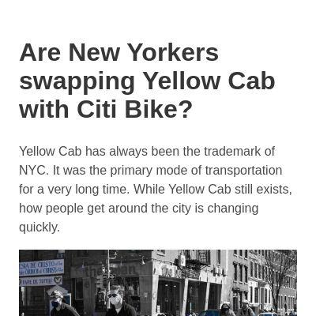](screenshots/ayukaak.github.io/Citibike_index.html-mobile-full.jpg)|[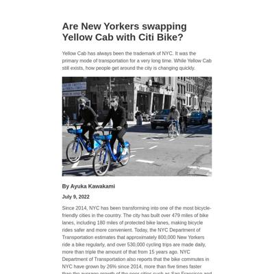](screenshots/ayukaak.github.io/Citibike_index.html-medium-full.jpg)|[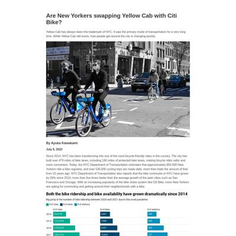](screenshots/ayukaak.github.io/Citibike_index.html-wide-full.jpg)|
|[Is climate change threatening food security in Tanzania?](https://ayukaak.github.io/ClimateChangeInTanzania/) :x: og:title :x: og:description :x: og:image [how to fix](tips/SOCIAL.md)|||[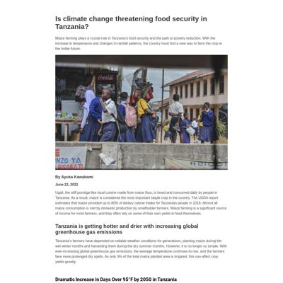](screenshots/ayukaak.github.io/ClimateChangeInTanzania_index.html-wide-full.jpg)|

### Automatic Checks

**https://ayukaak.github.io/Citibike/**

* Change URL to be all in lowercase
* Add a link to the repository with your source code/data/analysis: [tutorial](https://jonathansoma.com/fancy-github/), [example](https://github.com/ilenapeng/stevens-creek) from [a story](https://ilenapeng.github.io/data-studio/stevens-creek/)

**https://ayukaak.github.io/ClimateChangeInTanzania/**

* Change URL to be all in lowercase
* Add a link to the repository with your source code/data/analysis: [tutorial](https://jonathansoma.com/fancy-github/), [example](https://github.com/ilenapeng/stevens-creek) from [a story](https://ilenapeng.github.io/data-studio/stevens-creek/)

## bryanbaker-11.github.io

|url|mobile|medium|wide|
|---|---|---|---|
|[MLB Shift Story](https://bryanbaker-11.github.io/lhh-shift/) :x: og:title :x: og:description :x: og:image [how to fix](tips/SOCIAL.md)|[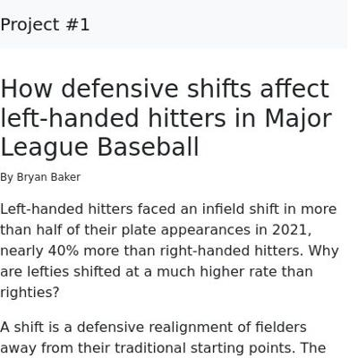](screenshots/bryanbaker-11.github.io/lhh-shift_index.html-mobile-full.jpg)|[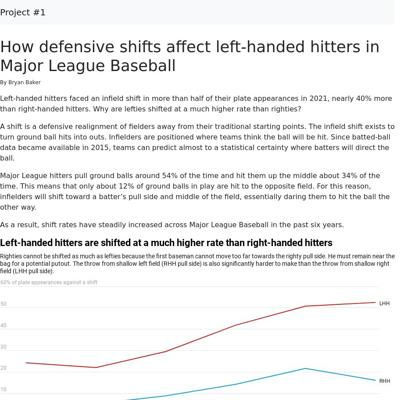](screenshots/bryanbaker-11.github.io/lhh-shift_index.html-medium-full.jpg)||
|[Who were the unluckiest hitters in 2021?](https://bryanbaker-11.github.io/unlucky-hitters-2021/) :x: og:title :x: og:description :x: og:image [how to fix](tips/SOCIAL.md)|[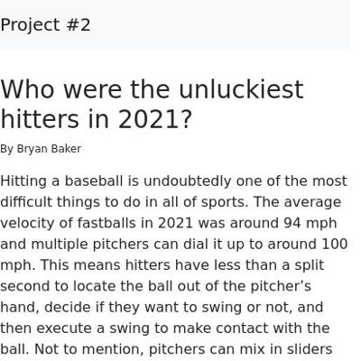](screenshots/bryanbaker-11.github.io/unlucky-hitters-2021_index.html-mobile-full.jpg)|[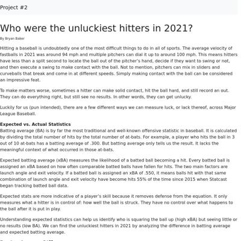](screenshots/bryanbaker-11.github.io/unlucky-hitters-2021_index.html-medium-full.jpg)|[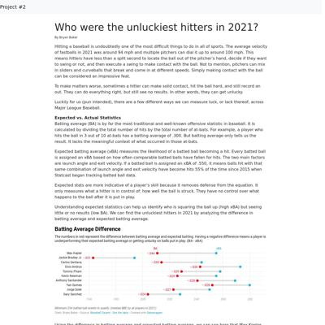](screenshots/bryanbaker-11.github.io/unlucky-hitters-2021_index.html-wide-full.jpg)|

### Automatic Checks

**https://bryanbaker-11.github.io/lhh-shift/**

* Has sideways scrollbars in mobile version – check padding, margins, image widths. Also make sure any embeds are the responsive version. [How to view the mobile version](https://www.howtogeek.com/739812/how-to-view-mobile-websites-on-your-computer-in-chrome/)
* Add a link to the repository with your source code/data/analysis: [tutorial](https://jonathansoma.com/fancy-github/), [example](https://github.com/ilenapeng/stevens-creek) from [a story](https://ilenapeng.github.io/data-studio/stevens-creek/)

**https://bryanbaker-11.github.io/unlucky-hitters-2021/**

* Image(s) need `alt` tags, [info here](https://abilitynet.org.uk/news-blogs/five-golden-rules-compliant-alt-text) and [tips here](https://twitter.com/FrankElavsky/status/1469023374529765385)
    * Image `images/slugging-formula.jpg` missing `alt` tag
    * Image `images/wOBA-formula.png` missing `alt` tag
* Has sideways scrollbars in mobile version – check padding, margins, image widths. Also make sure any embeds are the responsive version. [How to view the mobile version](https://www.howtogeek.com/739812/how-to-view-mobile-websites-on-your-computer-in-chrome/)
* Add a link to the repository with your source code/data/analysis: [tutorial](https://jonathansoma.com/fancy-github/), [example](https://github.com/ilenapeng/stevens-creek) from [a story](https://ilenapeng.github.io/data-studio/stevens-creek/)

## carolinaszv.github.io

|url|mobile|medium|wide|
|---|---|---|---|
|[USA holds World Cup attendance record](https://carolinaszv.github.io/1994-us-world-cup-attendance-record/) :x: og:title :x: og:description :x: og:image [how to fix](tips/SOCIAL.md)|[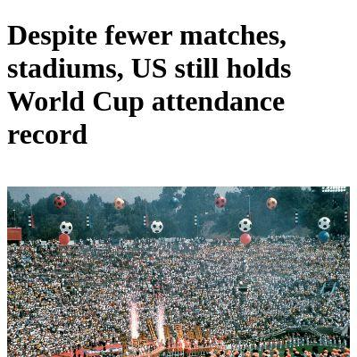](screenshots/carolinaszv.github.io/1994-us-world-cup-attendance-record_index.html-mobile-full.jpg)|[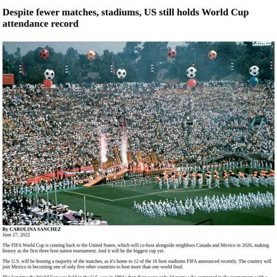](screenshots/carolinaszv.github.io/1994-us-world-cup-attendance-record_index.html-medium-full.jpg)||

### Automatic Checks

**https://carolinaszv.github.io/1994-us-world-cup-attendance-record/**

* Image(s) need `alt` tags, [info here](https://abilitynet.org.uk/news-blogs/five-golden-rules-compliant-alt-text) and [tips here](https://twitter.com/FrankElavsky/status/1469023374529765385)
    * Image `https://upload.wikimedia.org/wikipedia/commons/3/3c/0094_Sports_-_1994_World_Cup_01_%286956398635%29.jpg` missing `alt` tag
* Add a link to the repository with your source code/data/analysis: [tutorial](https://jonathansoma.com/fancy-github/), [example](https://github.com/ilenapeng/stevens-creek) from [a story](https://ilenapeng.github.io/data-studio/stevens-creek/)

## cpohkwan.github.io

|url|mobile|medium|wide|
|---|---|---|---|
|[Food Inflation](https://cpohkwan.github.io/food-inflation/) :x: og:title :x: og:description :x: og:image [how to fix](tips/SOCIAL.md)||[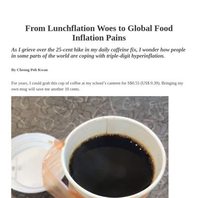](screenshots/cpohkwan.github.io/food-inflation_index.html-medium-full.jpg)|[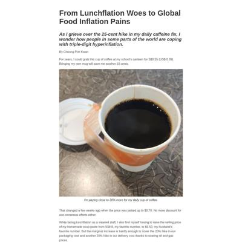](screenshots/cpohkwan.github.io/food-inflation_index.html-wide-full.jpg)|
|[My Project](https://cpohkwan.github.io/johnny_depp_amber_heard/) :x: og:title :x: og:description :x: og:image [how to fix](tips/SOCIAL.md)|[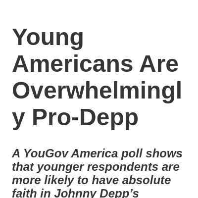](screenshots/cpohkwan.github.io/johnny_depp_amber_heard_index.html-mobile-full.jpg)|[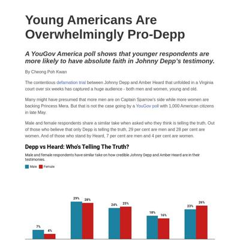](screenshots/cpohkwan.github.io/johnny_depp_amber_heard_index.html-medium-full.jpg)|[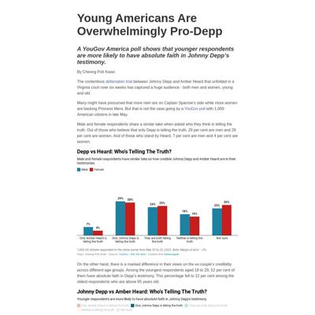](screenshots/cpohkwan.github.io/johnny_depp_amber_heard_index.html-wide-full.jpg)|

### Automatic Checks

**https://cpohkwan.github.io/food-inflation/**

* Add a link to the repository with your source code/data/analysis: [tutorial](https://jonathansoma.com/fancy-github/), [example](https://github.com/ilenapeng/stevens-creek) from [a story](https://ilenapeng.github.io/data-studio/stevens-creek/)

**https://cpohkwan.github.io/johnny_depp_amber_heard/**

* Change URL to use `-` instead of spaces or underscores
* Add a link to the repository with your source code/data/analysis: [tutorial](https://jonathansoma.com/fancy-github/), [example](https://github.com/ilenapeng/stevens-creek) from [a story](https://ilenapeng.github.io/data-studio/stevens-creek/)

## dabravs.github.io

|url|mobile|medium|wide|
|---|---|---|---|
|[This is how often each Pokémon type shows up in Gen 1](https://dabravs.github.io/pokemon-project/) :x: og:title :x: og:description :x: og:image [how to fix](tips/SOCIAL.md)|[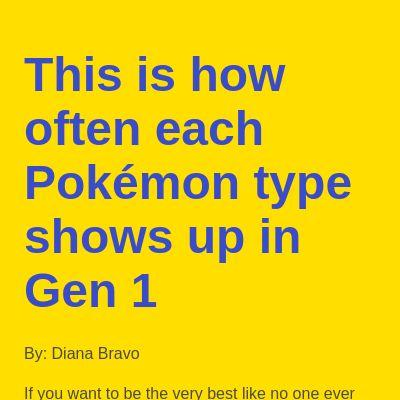](screenshots/dabravs.github.io/pokemon-project_index.html-mobile-full.jpg)|[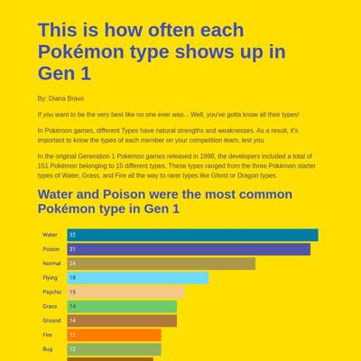](screenshots/dabravs.github.io/pokemon-project_index.html-medium-full.jpg)|[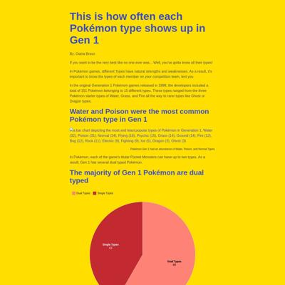](screenshots/dabravs.github.io/pokemon-project_index.html-wide-full.jpg)|
|[Site not found · GitHub Pages](https://dabravs.github.io/project-2-website/) :x: og:title :x: og:description :x: og:image [how to fix](tips/SOCIAL.md)|request failed|request failed|request failed|

### Automatic Checks

**https://dabravs.github.io/pokemon-project/**

* Simplify URL by removing `project`. For example, `dog-names` instead of `dog-names-project`.
* Add a link to the repository with your source code/data/analysis: [tutorial](https://jonathansoma.com/fancy-github/), [example](https://github.com/ilenapeng/stevens-creek) from [a story](https://ilenapeng.github.io/data-studio/stevens-creek/)

**https://dabravs.github.io/project-2-website/**

* Could not access the page - if you moved it, let me know
* Simplify URL by removing `project`. For example, `dog-names` instead of `dog-names-project`.
* Missing viewport meta tag in `<head>`, needed to tell browser it's responsive. Add `<meta name="viewport" content="width=device-width, initial-scale=1, shrink-to-fit=no">`
* Has sideways scrollbars in mobile version – check padding, margins, image widths. Also make sure any embeds are the responsive version. [How to view the mobile version](https://www.howtogeek.com/739812/how-to-view-mobile-websites-on-your-computer-in-chrome/)

## danielle-li.github.io

|url|mobile|medium|wide|
|---|---|---|---|
|[Climbing's Sexist Route Names](https://danielle-li.github.io/climbing-routes/) :x: og:title :x: og:description :x: og:image [how to fix](tips/SOCIAL.md)|[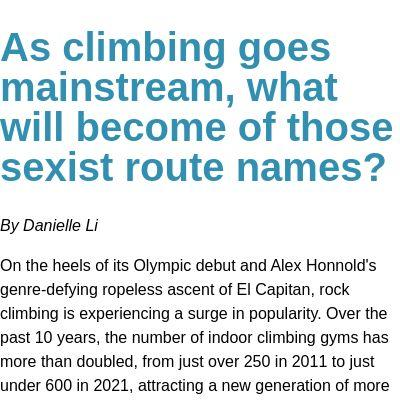](screenshots/danielle-li.github.io/climbing-routes_index.html-mobile-full.jpg)|[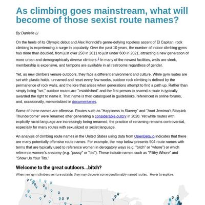](screenshots/danielle-li.github.io/climbing-routes_index.html-medium-full.jpg)|[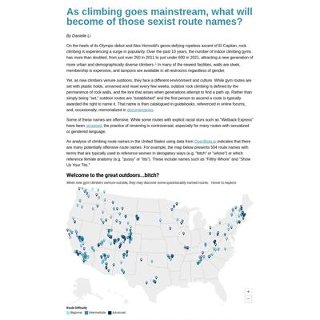](screenshots/danielle-li.github.io/climbing-routes_index.html-wide-full.jpg)|
|[Are millennials into avocado toast?](https://danielle-li.github.io/money-diaries/) :x: og:title :x: og:description :x: og:image [how to fix](tips/SOCIAL.md)|[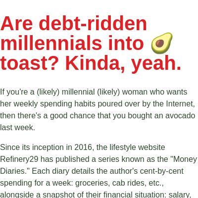](screenshots/danielle-li.github.io/money-diaries_index.html-mobile-full.jpg)|[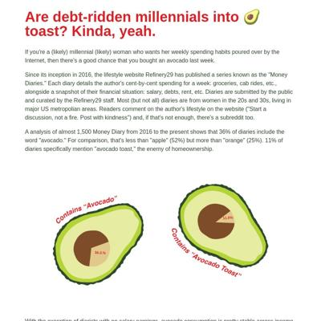](screenshots/danielle-li.github.io/money-diaries_index.html-medium-full.jpg)|[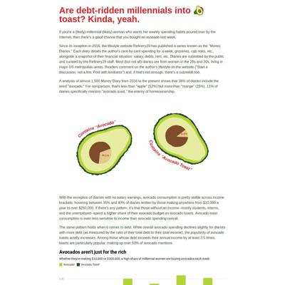](screenshots/danielle-li.github.io/money-diaries_index.html-wide-full.jpg)|

### Automatic Checks

**https://danielle-li.github.io/climbing-routes/**

No issues found! 🎉

**https://danielle-li.github.io/money-diaries/**

* Minimum font size should be 12px, enlarge text in Illustrator
    * Text `11.0%` is too small at 10px
    * Text `36.3.%` is too small at 10px

## danihisp.github.io

|url|mobile|medium|wide|
|---|---|---|---|
|[Webpage project](https://danihisp.github.io/olympics/) :x: og:title :x: og:description :x: og:image [how to fix](tips/SOCIAL.md)|[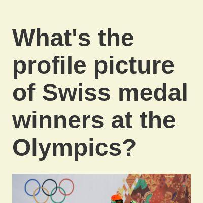](screenshots/danihisp.github.io/olympics_index.html-mobile-full.jpg)|[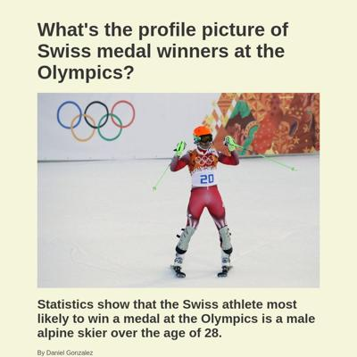](screenshots/danihisp.github.io/olympics_index.html-medium-full.jpg)|[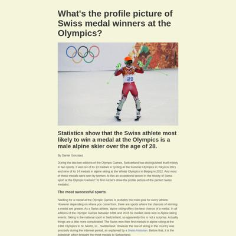](screenshots/danihisp.github.io/olympics_index.html-wide-full.jpg)|

### Automatic Checks

**https://danihisp.github.io/olympics/**

* Add a link to the repository with your source code/data/analysis: [tutorial](https://jonathansoma.com/fancy-github/), [example](https://github.com/ilenapeng/stevens-creek) from [a story](https://ilenapeng.github.io/data-studio/stevens-creek/)

## elizabethkli.github.io

|url|mobile|medium|wide|
|---|---|---|---|
|[Lizzie Li Project Website](https://elizabethkli.github.io/family-group-chat/) :x: og:title :x: og:description :x: og:image [how to fix](tips/SOCIAL.md)|[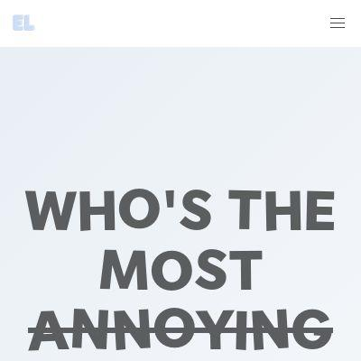](screenshots/elizabethkli.github.io/family-group-chat_index.html-mobile-full.jpg)|[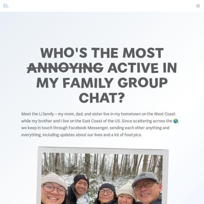](screenshots/elizabethkli.github.io/family-group-chat_index.html-medium-full.jpg)|[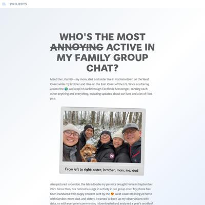](screenshots/elizabethkli.github.io/family-group-chat_index.html-wide-full.jpg)|

### Automatic Checks

**https://elizabethkli.github.io/family-group-chat/**

* Image(s) need `alt` tags, [info here](https://abilitynet.org.uk/news-blogs/five-golden-rules-compliant-alt-text) and [tips here](https://twitter.com/FrankElavsky/status/1469023374529765385)
    * Image `../logo.png` missing `alt` tag
    * Image `../famphoto.png` missing `alt` tag
* Add a link to the repository with your source code/data/analysis: [tutorial](https://jonathansoma.com/fancy-github/), [example](https://github.com/ilenapeng/stevens-creek) from [a story](https://ilenapeng.github.io/data-studio/stevens-creek/)

## erichbuergler.github.io

|url|mobile|medium|wide|
|---|---|---|---|
|[Avacado, coriander and chocolate can harm your health](https://erichbuergler.github.io/food-recalls/) :x: og:title :x: og:description :x: og:image [how to fix](tips/SOCIAL.md)||[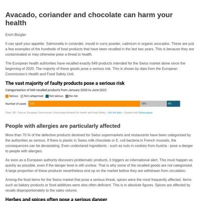](screenshots/erichbuergler.github.io/food-recalls_index.html-medium-full.jpg)|[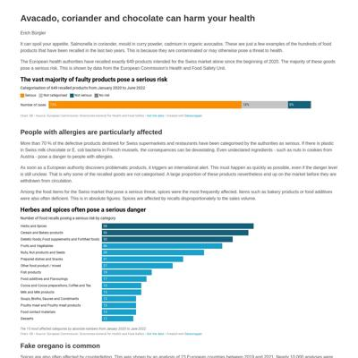](screenshots/erichbuergler.github.io/food-recalls_index.html-wide-full.jpg)|
|[Even if recycled: Disposable bottles are a big environmental burden](https://erichbuergler.github.io/Website/Beerpackaging.html) :x: og:title :x: og:description :x: og:image [how to fix](tips/SOCIAL.md)|[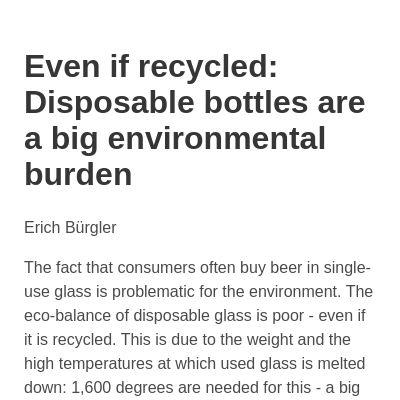](screenshots/erichbuergler.github.io/Website_Beerpackaging.html-mobile-full.jpg)|[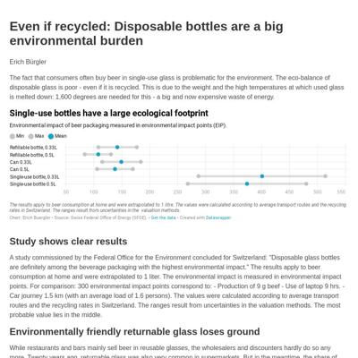](screenshots/erichbuergler.github.io/Website_Beerpackaging.html-medium-full.jpg)|[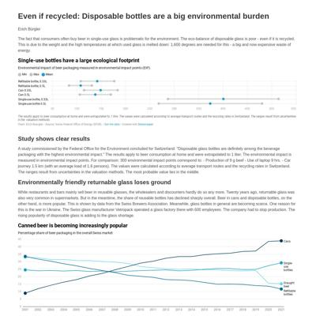](screenshots/erichbuergler.github.io/Website_Beerpackaging.html-wide-full.jpg)|

### Automatic Checks

**https://erichbuergler.github.io/food-recalls/**

* Add a link to the repository with your source code/data/analysis: [tutorial](https://jonathansoma.com/fancy-github/), [example](https://github.com/ilenapeng/stevens-creek) from [a story](https://ilenapeng.github.io/data-studio/stevens-creek/)

**https://erichbuergler.github.io/Website/Beerpackaging.html**

* Move `Website/Beerpackaging.html` into a folder called `Beerpackaging`, then rename the file `index.html`. That way the project can be found at **/Beerpackaging** instead of **/Beerpackaging.html**. [Read more about index.html here](https://www.thoughtco.com/index-html-page-3466505)
* Change URL to be all in lowercase
* Add a link to the repository with your source code/data/analysis: [tutorial](https://jonathansoma.com/fancy-github/), [example](https://github.com/ilenapeng/stevens-creek) from [a story](https://ilenapeng.github.io/data-studio/stevens-creek/)

## gabrielacarrasquillo.github.io

|url|mobile|medium|wide|
|---|---|---|---|
|[Page not found · GitHub Pages](https://gabrielacarrasquillo.github.io/beachfronts/project-website/) :x: og:title :x: og:description :x: og:image [how to fix](tips/SOCIAL.md)|request failed|request failed|request failed|
|[2022 is on track to break sargassum production records in the Atlantic Ocean](https://gabrielacarrasquillo.github.io/sargassum-story/) :x: og:title :x: og:description :x: og:image [how to fix](tips/SOCIAL.md)|[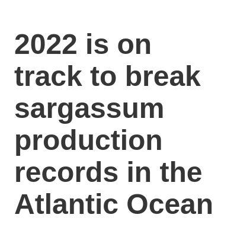](screenshots/gabrielacarrasquillo.github.io/sargassum-story_index.html-mobile-full.jpg)|||

### Automatic Checks

**https://gabrielacarrasquillo.github.io/beachfronts/project-website/**

* Could not access the page - if you moved it, let me know
* Simplify URL by removing `project`. For example, `dog-names` instead of `dog-names-project`.
* Missing viewport meta tag in `<head>`, needed to tell browser it's responsive. Add `<meta name="viewport" content="width=device-width, initial-scale=1, shrink-to-fit=no">`
* Has sideways scrollbars in mobile version – check padding, margins, image widths. Also make sure any embeds are the responsive version. [How to view the mobile version](https://www.howtogeek.com/739812/how-to-view-mobile-websites-on-your-computer-in-chrome/)

**https://gabrielacarrasquillo.github.io/sargassum-story/**

* Add a link to the repository with your source code/data/analysis: [tutorial](https://jonathansoma.com/fancy-github/), [example](https://github.com/ilenapeng/stevens-creek) from [a story](https://ilenapeng.github.io/data-studio/stevens-creek/)

## luyi-eve.github.io

|url|mobile|medium|wide|
|---|---|---|---|
|[Cool it?! New Yorkers](https://luyi-eve.github.io/cool-it-newyorkers/) :x: og:title :x: og:description :x: og:image [how to fix](tips/SOCIAL.md)||||
|[Project One](https://luyi-eve.github.io/project-one/) :x: og:title :x: og:description :x: og:image [how to fix](tips/SOCIAL.md)||||

### Automatic Checks

**https://luyi-eve.github.io/cool-it-newyorkers/**

* Has sideways scrollbars in mobile version – check padding, margins, image widths. Also make sure any embeds are the responsive version. [How to view the mobile version](https://www.howtogeek.com/739812/how-to-view-mobile-websites-on-your-computer-in-chrome/)

**https://luyi-eve.github.io/project-one/**

* Image(s) need `alt` tags, [info here](https://abilitynet.org.uk/news-blogs/five-golden-rules-compliant-alt-text) and [tips here](https://twitter.com/FrankElavsky/status/1469023374529765385)
    * Image `Word cloud.svg` missing `alt` tag
    * Image `gender.svg` missing `alt` tag
    * Image `age.svg` missing `alt` tag
    * Image `mapping.svg` missing `alt` tag
    * Image `locations.svg` missing `alt` tag
    * Image `types.svg` missing `alt` tag
    * Image `reasons.svg` missing `alt` tag
* Simplify URL by removing `project`. For example, `dog-names` instead of `dog-names-project`.
* Add a link to the repository with your source code/data/analysis: [tutorial](https://jonathansoma.com/fancy-github/), [example](https://github.com/ilenapeng/stevens-creek) from [a story](https://ilenapeng.github.io/data-studio/stevens-creek/)

## mcoloncruz.github.io

|url|mobile|medium|wide|
|---|---|---|---|
|[housing](https://mcoloncruz.github.io/housing/) :x: og:title :x: og:description :x: og:image [how to fix](tips/SOCIAL.md)||||
|[Guns and femicides](https://mcoloncruz.github.io/project-femicides/) :x: og:title :x: og:description :x: og:image [how to fix](tips/SOCIAL.md)||||

### Automatic Checks

**https://mcoloncruz.github.io/housing/**

* Has sideways scrollbars in mobile version – check padding, margins, image widths. Also make sure any embeds are the responsive version. [How to view the mobile version](https://www.howtogeek.com/739812/how-to-view-mobile-websites-on-your-computer-in-chrome/)
* Add a link to the repository with your source code/data/analysis: [tutorial](https://jonathansoma.com/fancy-github/), [example](https://github.com/ilenapeng/stevens-creek) from [a story](https://ilenapeng.github.io/data-studio/stevens-creek/)

**https://mcoloncruz.github.io/project-femicides/**

* Image(s) need `alt` tags, [info here](https://abilitynet.org.uk/news-blogs/five-golden-rules-compliant-alt-text) and [tips here](https://twitter.com/FrankElavsky/status/1469023374529765385)
    * Image `62219986_356090471706116_7564854086038716416_n.jpg` missing `alt` tag
* Simplify URL by removing `project`. For example, `dog-names` instead of `dog-names-project`.
* Add a link to the repository with your source code/data/analysis: [tutorial](https://jonathansoma.com/fancy-github/), [example](https://github.com/ilenapeng/stevens-creek) from [a story](https://ilenapeng.github.io/data-studio/stevens-creek/)

## miotomita.github.io

|url|mobile|medium|wide|
|---|---|---|---|
|[Japan on a Tightrope](https://miotomita.github.io/japan-on-a-tightrope/) :x: og:title :x: og:description :x: og:image [how to fix](tips/SOCIAL.md)||||
|[Risk of Bird Extinction Remains High](https://miotomita.github.io/Lede_project1/) :x: og:title :x: og:description :x: og:image [how to fix](tips/SOCIAL.md)||||

### Automatic Checks

**https://miotomita.github.io/japan-on-a-tightrope/**

No issues found! 🎉

**https://miotomita.github.io/Lede_project1/**

* Simplify URL by removing `project`. For example, `dog-names` instead of `dog-names-project`.
* Change URL to use `-` instead of spaces or underscores
* Change URL to be all in lowercase
* Add a link to the repository with your source code/data/analysis: [tutorial](https://jonathansoma.com/fancy-github/), [example](https://github.com/ilenapeng/stevens-creek) from [a story](https://ilenapeng.github.io/data-studio/stevens-creek/)

## mvol4ok.github.io

|url|mobile|medium|wide|
|---|---|---|---|
|[Goes up top!!!!](https://mvol4ok.github.io/) :x: og:title :x: og:description :x: og:image [how to fix](tips/SOCIAL.md)||||

### Automatic Checks

**https://mvol4ok.github.io/**

* Add a link to the repository with your source code/data/analysis: [tutorial](https://jonathansoma.com/fancy-github/), [example](https://github.com/ilenapeng/stevens-creek) from [a story](https://ilenapeng.github.io/data-studio/stevens-creek/)

## nkalanga.github.io

|url|mobile|medium|wide|
|---|---|---|---|
|[Site not found · GitHub Pages](https://NKalanga.github.io/Mat_South_COVID_Vaccination_Data/) :x: og:title :x: og:description :x: og:image [how to fix](tips/SOCIAL.md)|request failed|request failed|request failed|

### Automatic Checks

**https://NKalanga.github.io/Mat_South_COVID_Vaccination_Data/**

* Could not access the page - if you moved it, let me know
* Change URL to use `-` instead of spaces or underscores
* Change URL to be all in lowercase
* Missing viewport meta tag in `<head>`, needed to tell browser it's responsive. Add `<meta name="viewport" content="width=device-width, initial-scale=1, shrink-to-fit=no">`
* Has sideways scrollbars in mobile version – check padding, margins, image widths. Also make sure any embeds are the responsive version. [How to view the mobile version](https://www.howtogeek.com/739812/how-to-view-mobile-websites-on-your-computer-in-chrome/)

## obverter.github.io

|url|mobile|medium|wide|
|---|---|---|---|
|[obvertɘr is Ben Elliott  I’m an overenthusiastic data herder who spends too much time worrying and/or writing about, among other things, weird books and millionaires standing around outside in their pajamas. In my free time I enjoy collecting hobbies, giving up on personal projects, and frisbeeing my dog into the Shadow Realm.](https://obverter.github.io/complete-games/) :x: og:image [how to fix](tips/SOCIAL.md)|request failed|request failed|request failed|
|[obvertɘr is Ben Elliott  I’m an overenthusiastic data herder who spends too much time worrying and/or writing about, among other things, weird books and millionaires standing around outside in their pajamas. In my free time I enjoy collecting hobbies, giving up on personal projects, and frisbeeing my dog into the Shadow Realm.](https://obverter.github.io/heavy-hitters/) :x: og:image [how to fix](tips/SOCIAL.md)|request failed|request failed|request failed|

### Automatic Checks

**https://obverter.github.io/complete-games/**

* Image(s) need `alt` tags, [info here](https://abilitynet.org.uk/news-blogs/five-golden-rules-compliant-alt-text) and [tips here](https://twitter.com/FrankElavsky/status/1469023374529765385)
    * Image `` missing `alt` tag
* Could not access the page - if you moved it, let me know

**https://obverter.github.io/heavy-hitters/**

* Image(s) need `alt` tags, [info here](https://abilitynet.org.uk/news-blogs/five-golden-rules-compliant-alt-text) and [tips here](https://twitter.com/FrankElavsky/status/1469023374529765385)
    * Image `` missing `alt` tag
* Could not access the page - if you moved it, let me know

## onlyandrewn.github.io

|url|mobile|medium|wide|
|---|---|---|---|
|[Are tornadoes in the U.S. becoming more frequent and more intense?](https://onlyandrewn.github.io/project-01/) :x: og:title :x: og:description :x: og:image [how to fix](tips/SOCIAL.md)||||
|[How has the Tour de France changed in the last 100 years?](https://onlyandrewn.github.io/tour-de-france/)||||

### Automatic Checks

**https://onlyandrewn.github.io/project-01/**

* Simplify URL by removing `project`. For example, `dog-names` instead of `dog-names-project`.
* Add a link to the repository with your source code/data/analysis: [tutorial](https://jonathansoma.com/fancy-github/), [example](https://github.com/ilenapeng/stevens-creek) from [a story](https://ilenapeng.github.io/data-studio/stevens-creek/)

**https://onlyandrewn.github.io/tour-de-france/**

* Missing font(s), you might need web fonts – [text explanation](https://gist.github.com/jsoma/631621e0807b26d49f5aef5260f79162), [video explanation](https://www.youtube.com/watch?v=HNhIeb_jEYM&list=PLewNEVDy7gq3MSrrO3eMEW8PhGMEVh2X2&index=3)
    * `NYTFranklin-Bold` font not found, used in 8 text objects. Example: _2010s, 1900s, 2010s_
    * `NYTFranklin-Medium` font not found, used in 8 text objects. Example: _24.94 m.p.h., 15.83 m.p.h., 24.94 m.p.h._
* Add a link to the repository with your source code/data/analysis: [tutorial](https://jonathansoma.com/fancy-github/), [example](https://github.com/ilenapeng/stevens-creek) from [a story](https://ilenapeng.github.io/data-studio/stevens-creek/)

## oparra06.github.io

|url|mobile|medium|wide|
|---|---|---|---|
|[Site not found · GitHub Pages](https://oparra06.github.io/Oscar-Parra-Lede-Project/) :x: og:title :x: og:description :x: og:image [how to fix](tips/SOCIAL.md)|request failed|request failed|request failed|

### Automatic Checks

**https://oparra06.github.io/Oscar-Parra-Lede-Project/**

* Could not access the page - if you moved it, let me know
* Change URL to be all in lowercase
* Missing viewport meta tag in `<head>`, needed to tell browser it's responsive. Add `<meta name="viewport" content="width=device-width, initial-scale=1, shrink-to-fit=no">`
* Has sideways scrollbars in mobile version – check padding, margins, image widths. Also make sure any embeds are the responsive version. [How to view the mobile version](https://www.howtogeek.com/739812/how-to-view-mobile-websites-on-your-computer-in-chrome/)

## petebrown.github.io

|url|mobile|medium|wide|
|---|---|---|---|
|[Project 1: A Couple of Charts](https://petebrown.github.io/project-01/) :x: og:title :x: og:description :x: og:image [how to fix](tips/SOCIAL.md)||||

### Automatic Checks

**https://petebrown.github.io/project-01/**

* Simplify URL by removing `project`. For example, `dog-names` instead of `dog-names-project`.
* Add a link to the repository with your source code/data/analysis: [tutorial](https://jonathansoma.com/fancy-github/), [example](https://github.com/ilenapeng/stevens-creek) from [a story](https://ilenapeng.github.io/data-studio/stevens-creek/)

## ramanshreya.github.io

|url|mobile|medium|wide|
|---|---|---|---|
|[Why does India have high beef exports?](https://ramanshreya.github.io/beef-exports-and-dairy-industry-in-india/) :x: og:title :x: og:description :x: og:image [how to fix](tips/SOCIAL.md)||||
|[Are Women Really Bad At Chess? Why Does Data Make Us Believe So?](https://ramanshreya.github.io/female-chess-players/) :x: og:title :x: og:description :x: og:image [how to fix](tips/SOCIAL.md)||||

### Automatic Checks

**https://ramanshreya.github.io/beef-exports-and-dairy-industry-in-india/**

* Minimum font size should be 12px, enlarge text in Illustrator
    * Text `1.6 Billion kilograms` is too small at 10px
    * Text `1.2B` is too small at 10px
    * Text `800M` is too small at 10px
    * Text `400M` is too small at 10px
    * Text `2004-05` is too small at 10px
    * Text `2010-11` is too small at 10px
    * Text `2016-17` is too small at 10px
    * *and 13 more*
* Overlapping elements in ai2html, check [the overflow video](https://www.youtube.com/watch?v=6vHsnjTp3_w) or make a smaller size
   * Text `1950-51` overlaps with `1980-81` at screen width 400
   * Text `1980-81` overlaps with `1986-87` at screen width 400
   * Text `1986-87` overlaps with `1992-93` at screen width 400
   * Text `1992-93` overlaps with `1998-99` at screen width 400
   * Text `1998-99` overlaps with `2004-05` at screen width 400
   * Text `2004-05` overlaps with `2010-11` at screen width 400
   * Text `2010-11` overlaps with `2016-17` at screen width 400
   * *and 30 more*
* Add a link to the repository with your source code/data/analysis: [tutorial](https://jonathansoma.com/fancy-github/), [example](https://github.com/ilenapeng/stevens-creek) from [a story](https://ilenapeng.github.io/data-studio/stevens-creek/)

**https://ramanshreya.github.io/female-chess-players/**

No issues found! 🎉

## rlwin.github.io

|url|mobile|medium|wide|
|---|---|---|---|
|[Project 1](https://rlwin.github.io/project1/project1.html) :x: og:title :x: og:description :x: og:image [how to fix](tips/SOCIAL.md)||||
|[Project 1](https://rlwin.github.io/project2/project2.html) :x: og:title :x: og:description :x: og:image [how to fix](tips/SOCIAL.md)||||

### Automatic Checks

**https://rlwin.github.io/project1/project1.html**

* Move `project1/project1.html` into a folder called `project1`, then rename the file `index.html`. That way the project can be found at **/project1** instead of **/project1.html**. [Read more about index.html here](https://www.thoughtco.com/index-html-page-3466505)
* Simplify URL by removing `project`. For example, `dog-names` instead of `dog-names-project`.
* Add a link to the repository with your source code/data/analysis: [tutorial](https://jonathansoma.com/fancy-github/), [example](https://github.com/ilenapeng/stevens-creek) from [a story](https://ilenapeng.github.io/data-studio/stevens-creek/)

**https://rlwin.github.io/project2/project2.html**

* Move `project2/project2.html` into a folder called `project2`, then rename the file `index.html`. That way the project can be found at **/project2** instead of **/project2.html**. [Read more about index.html here](https://www.thoughtco.com/index-html-page-3466505)
* Simplify URL by removing `project`. For example, `dog-names` instead of `dog-names-project`.
* Minimum font size should be 12px, enlarge text in Illustrator
    * Text `2020-2021` is too small at 8px
    * Text `2020-2021` is too small at 8px
    * Text `2019 report from NHTSA of crashes` is too small at 6px
    * Text `that resulted in fatality or injury.` is too small at 6px
    * Text `2019 report from NHTSA of crashes` is too small at 9px
    * Text `that resulted in fatality or injury.` is too small at 9px
    * Text `2019 report from NHTSA of crashes` is too small at 9px
    * *and 2 more*
* Overlapping elements in ai2html, check [the overflow video](https://www.youtube.com/watch?v=6vHsnjTp3_w) or make a smaller size
   * Text `0%` overlaps with `2020-2021` at screen width 400
   * Text `0%` overlaps with `2020-2021` at screen width 900
   * Text `0%` overlaps with `2020-2021` at screen width 1300
   * Text `11%` overlaps with `2020-2021` at screen width 1300
* Add a link to the repository with your source code/data/analysis: [tutorial](https://jonathansoma.com/fancy-github/), [example](https://github.com/ilenapeng/stevens-creek) from [a story](https://ilenapeng.github.io/data-studio/stevens-creek/)

## sharmaraghavi.github.io

|url|mobile|medium|wide|
|---|---|---|---|
|[Income of Indian National Political Parties](https://sharmaraghavi.github.io/income/) :x: og:title :x: og:description :x: og:image [how to fix](tips/SOCIAL.md)||||

### Automatic Checks

**https://sharmaraghavi.github.io/income/**

* Has sideways scrollbars in mobile version – check padding, margins, image widths. Also make sure any embeds are the responsive version. [How to view the mobile version](https://www.howtogeek.com/739812/how-to-view-mobile-websites-on-your-computer-in-chrome/)
* Add a link to the repository with your source code/data/analysis: [tutorial](https://jonathansoma.com/fancy-github/), [example](https://github.com/ilenapeng/stevens-creek) from [a story](https://ilenapeng.github.io/data-studio/stevens-creek/)

## smeana5.github.io

|url|mobile|medium|wide|
|---|---|---|---|
|[fifa-selection-2022/index.html](https://smeana5.github.io/fifa-selection-2022/) :x: og:title :x: og:description :x: og:image [how to fix](tips/SOCIAL.md)||||
|[Who imports gasoline to Mexico](https://smeana5.github.io/us-mexico-gasoline-trade/) :x: og:title :x: og:description :x: og:image [how to fix](tips/SOCIAL.md)||||

### Automatic Checks

**https://smeana5.github.io/fifa-selection-2022/**

* Needs a title, add a `<title>` tag to the `<head>`
* Add a link to the repository with your source code/data/analysis: [tutorial](https://jonathansoma.com/fancy-github/), [example](https://github.com/ilenapeng/stevens-creek) from [a story](https://ilenapeng.github.io/data-studio/stevens-creek/)

**https://smeana5.github.io/us-mexico-gasoline-trade/**

* Has sideways scrollbars in mobile version – check padding, margins, image widths. Also make sure any embeds are the responsive version. [How to view the mobile version](https://www.howtogeek.com/739812/how-to-view-mobile-websites-on-your-computer-in-chrome/)
* Overlapping elements in ai2html, check [the overflow video](https://www.youtube.com/watch?v=6vHsnjTp3_w) or make a smaller size
   * Text `By Sergio Meana` overlaps with `Vortexa` at screen width 400
   * Text `Chart:` overlaps with `​ ​` at screen width 900
   * Text `Chart:` overlaps with `By Sergio Meana` at screen width 900
   * Text `​ ​` overlaps with `By Sergio Meana` at screen width 900
   * Text `​ ​` overlaps with `•` at screen width 900
   * Text `​ ​` overlaps with `​ ​` at screen width 900
   * Text `​ ​` overlaps with `Source` at screen width 900
   * *and 32 more*
* Add a link to the repository with your source code/data/analysis: [tutorial](https://jonathansoma.com/fancy-github/), [example](https://github.com/ilenapeng/stevens-creek) from [a story](https://ilenapeng.github.io/data-studio/stevens-creek/)

## stanleydai.github.io

|url|mobile|medium|wide|
|---|---|---|---|
|[The human urge to climb our tallest mountains, and the equally human urge to document it for sale](https://stanleydai.github.io/himalaya_authors/) :x: og:title :x: og:description :x: og:image [how to fix](tips/SOCIAL.md)||||
|[NBA rookies and their winning contributions](https://stanleydai.github.io/nba_rookies_age/) :x: og:title :x: og:description :x: og:image [how to fix](tips/SOCIAL.md)||||

### Automatic Checks

**https://stanleydai.github.io/himalaya_authors/**

* Change URL to use `-` instead of spaces or underscores

**https://stanleydai.github.io/nba_rookies_age/**

* Change URL to use `-` instead of spaces or underscores

## tengj98.github.io

|url|mobile|medium|wide|
|---|---|---|---|
|[How COVID-19 upended bankruptcy trends](https://tengj98.github.io/covidbankruptcy/)||||
|[Are we headed for a recession? The bond market thinks so.](https://tengj98.github.io/yieldcurve/)||||

### Automatic Checks

**https://tengj98.github.io/covidbankruptcy/**

* Add a link to the repository with your source code/data/analysis: [tutorial](https://jonathansoma.com/fancy-github/), [example](https://github.com/ilenapeng/stevens-creek) from [a story](https://ilenapeng.github.io/data-studio/stevens-creek/)

**https://tengj98.github.io/yieldcurve/**

* Add a link to the repository with your source code/data/analysis: [tutorial](https://jonathansoma.com/fancy-github/), [example](https://github.com/ilenapeng/stevens-creek) from [a story](https://ilenapeng.github.io/data-studio/stevens-creek/)

## terril68.github.io

|url|mobile|medium|wide|
|---|---|---|---|
|[Teresa Liu's first LEDE project](https://terril68.github.io/animals-adoptions-during-the-pandemic/) :x: og:title :x: og:description :x: og:image [how to fix](tips/SOCIAL.md)||||

### Automatic Checks

**https://terril68.github.io/animals-adoptions-during-the-pandemic/**

* Add a link to the repository with your source code/data/analysis: [tutorial](https://jonathansoma.com/fancy-github/), [example](https://github.com/ilenapeng/stevens-creek) from [a story](https://ilenapeng.github.io/data-studio/stevens-creek/)

## torythetortle.github.io

|url|mobile|medium|wide|
|---|---|---|---|
|[Tory Lysik SNL Project](https://torythetortle.github.io/tory-snl/) :x: og:title :x: og:description :x: og:image [how to fix](tips/SOCIAL.md)||||

### Automatic Checks

**https://torythetortle.github.io/tory-snl/**

* Missing viewport meta tag in `<head>`, needed to tell browser it's responsive. Add `<meta name="viewport" content="width=device-width, initial-scale=1, shrink-to-fit=no">`
* Minimum font size should be 12px, enlarge text in Illustrator
    * Text `Brooks` is too small at 6px
    * Text `Whelan 34` is too small at 6px
    * Text `50 or Less` is too small at 10px
    * Text `Garrett Morris 252` is too small at 8px
    * Text `Shasheer Zamata 84` is too small at 7px
    * Text `Paul Brittan 72` is too small at 7px
    * Text `Buck` is too small at 6px
    * *and 39 more*
* Overlapping elements in ai2html, check [the overflow video](https://www.youtube.com/watch?v=6vHsnjTp3_w) or make a smaller size
   * Text `WHO APPEARED THE MOST IN THE TOP 25 SEASONS?` overlaps with `Brooks` at screen width 400
   * Text `WHO APPEARED THE MOST IN THE TOP 25 SEASONS?` overlaps with `Whelan 34` at screen width 400
   * Text `WHO APPEARED THE MOST IN THE TOP 25 SEASONS?` overlaps with `50 or Less` at screen width 400
   * Text `WHO APPEARED THE MOST IN THE TOP 25 SEASONS?` overlaps with `Garrett Morris 252` at screen width 400
   * Text `WHO APPEARED THE MOST IN THE TOP 25 SEASONS?` overlaps with `Shasheer Zamata 84` at screen width 400
   * Text `WHO APPEARED THE MOST IN THE TOP 25 SEASONS?` overlaps with `Paul Brittan 72` at screen width 400
   * Text `WHO APPEARED THE MOST IN THE TOP 25 SEASONS?` overlaps with `Buck` at screen width 400
   * *and 40 more*
* Add a link to the repository with your source code/data/analysis: [tutorial](https://jonathansoma.com/fancy-github/), [example](https://github.com/ilenapeng/stevens-creek) from [a story](https://ilenapeng.github.io/data-studio/stevens-creek/)

## vlsachdev.github.io

|url|mobile|medium|wide|
|---|---|---|---|
|[Cryptocuurency_Gold](https://vlsachdev.github.io/cryptocurreny_gold/) :x: og:title :x: og:description :x: og:image [how to fix](tips/SOCIAL.md)||||

### Automatic Checks

**https://vlsachdev.github.io/cryptocurreny_gold/**

* Change URL to use `-` instead of spaces or underscores
* Add a link to the repository with your source code/data/analysis: [tutorial](https://jonathansoma.com/fancy-github/), [example](https://github.com/ilenapeng/stevens-creek) from [a story](https://ilenapeng.github.io/data-studio/stevens-creek/)

## yikchun-l.github.io

|url|mobile|medium|wide|
|---|---|---|---|
|[Will Adopting Apps Reverse Singapore's Taxi Shortage?](https://yikchun-l.github.io/project-01/) :x: og:title :x: og:description :x: og:image [how to fix](tips/SOCIAL.md)||||

### Automatic Checks

**https://yikchun-l.github.io/project-01/**

* Simplify URL by removing `project`. For example, `dog-names` instead of `dog-names-project`.
* Add a link to the repository with your source code/data/analysis: [tutorial](https://jonathansoma.com/fancy-github/), [example](https://github.com/ilenapeng/stevens-creek) from [a story](https://ilenapeng.github.io/data-studio/stevens-creek/)

